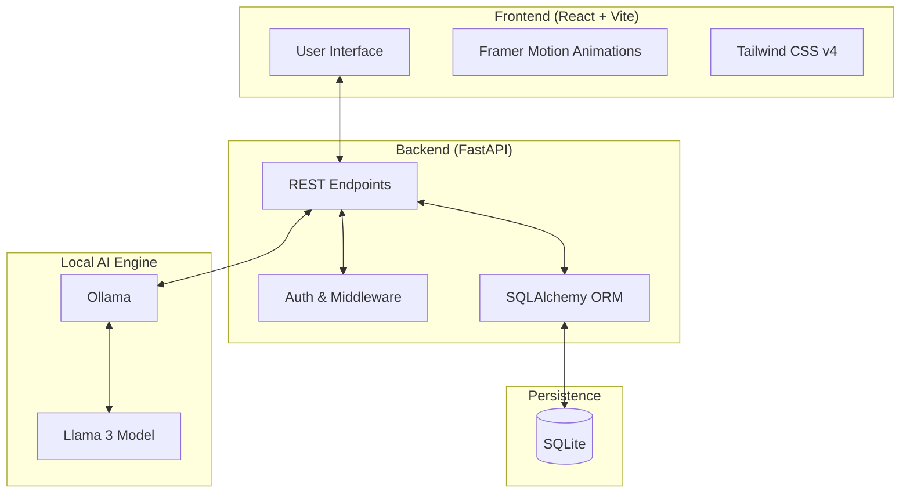

# 🚀 CareerFlux: AI-Powered Student Dashboard

**CareerFlux** is a privacy-first, visually stunning AI student companion. It leverages local Large Language Models (LLMs) via Ollama to provide high-performance academic assistance without compromising data privacy.

---

## ✨ Features

- 📄 **AI Resume Analyzer**: Upload your details and get instant professional feedback.
- 🛤️ **Career Guidance**: Explore personalized career paths and roadmaps.
- 📝 **Smart Notes Generator**: Transform unstructured thoughts into clean, organized notes.
- 🧠 **Quiz Generator**: Generate interactive MCQs to test your knowledge on any subject.
- 💬 **Privacy-First Chat**: General AI assistance powered by **local llama3**, ensuring your data never leaves your machine.
- 🔐 **Secure Authentication**: Robust JWT-based authentication system with encrypted password hashing.

---

## 🏗️ Architecture

CareerFlux follows a modern decoupled architecture:



---

## 🛠️ Technology Stack

| Component | Technology | Description |
| :--- | :--- | :--- |
| **Frontend** | [React 19](https://react.dev/) | Library for building user interfaces. |
| **Bundler** | [Vite 8](https://vitejs.dev/) | Next-generation frontend tooling. |
| **Styling** | [Tailwind CSS 4](https://tailwindcss.com/) | Utility-first CSS framework. |
| **Animations** | [Framer Motion](https://www.framer.com/motion/) | Production-ready motion library. |
| **Backend** | [FastAPI](https://fastapi.tiangolo.com/) | High-performance Python web framework. |
| **Database** | [SQLAlchemy](https://www.sqlalchemy.org/) | Python SQL toolkit and Object Relational Mapper. |
| **AI Engine** | [Ollama](https://ollama.com/) | Local execution of large language models. |

---

## 📥 Getting Started

### Prerequisites

1.  **Ollama**: Download and install from [ollama.com](https://ollama.com/).
    -   Once installed, pull the required model:
      ```bash
      ollama pull llama3
      ```
2.  **Python**: Ensure you have Python 3.9+ installed.
3.  **Node.js**: Ensure you have Node.js 18+ and npm installed.

### Installation

#### 1. Clone the Repository
```bash
git clone https://github.com/yourusername/carrearflux.git
cd carrearflux
```

#### 2. Backend Setup
```bash
cd backend
# Create a virtual environment
python -m venv venv
# Activate it (Windows)
.\venv\Scripts\activate
# Activate it (Linux/macOS)
# source venv/bin/activate

# Install dependencies
pip install -r requirements.txt

# Start the server
uvicorn main:app --reload
```
*The backend will be available at `http://127.0.0.1:8000`*

#### 3. Frontend Setup
```bash
cd ../frontend
# Install dependencies
npm install

# Start the development server
npm run dev
```
*The frontend will be available at `http://localhost:5173`*

---

## 📁 Project Structure

```text
carrearflux/
├── backend/
│   ├── auth.py            # JWT Authentication logic
│   ├── database.py        # SQLAlchemy models and DB config
│   ├── main.py            # FastAPI routes and application entry
│   ├── ollama_client.py   # AI integration logic
│   ├── careerflux.db      # SQLite database
│   └── requirements.txt   # Python dependencies
├── frontend/
│   ├── src/
│   │   ├── components/    # Reusable UI components
│   │   ├── pages/         # Dashboard and Auth pages
│   │   └── App.jsx        # Main application logic
│   ├── tailwind.config.js # Styling configuration
│   └── package.json       # Node dependencies
└── README.md              # Project documentation
```

---

## 🔒 Security & Privacy

- **No Cloud AI**: CareerFlux does not send your data to OpenAI, Google, or any other cloud provider. All AI processing happens locally on your hardware.
- **Data Persistence**: Your data is stored in a local SQLite database, giving you full control over your information.
- **Hashed Passwords**: User passwords are encrypted using `bcrypt` before being stored.

---

## 🤝 Contributing

Contributions are welcome! Please feel free to submit a Pull Request or open an issue for any bugs or feature requests.

---

## 📄 License

This project is licensed under the MIT License - see the LICENSE file for details.

